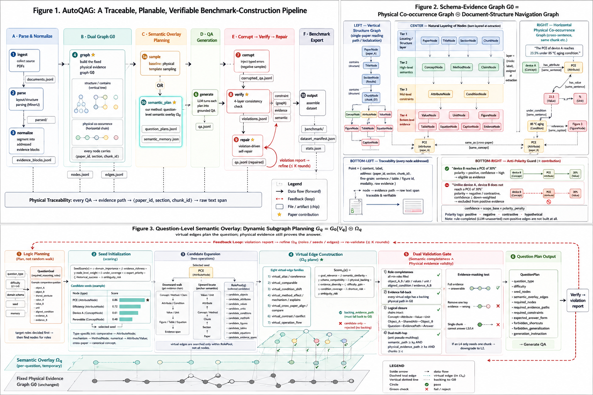

<div align="center">

# AutoQAGBenchmark

**A Graph-Anchored Auto-QAG Benchmark & Advanced-Corpus Construction Framework**

[简体中文](README.md) · 📖 **English**

Turn scientific PDFs into *traceable, verifiable, evaluable, trainable, and self-repairable* research data assets.

</div>

---

## TL;DR

Existing Auto-QAG approaches either flatten knowledge into a single KG (losing provenance, hard to verify) or stitch questions from chunk retrieval (pseudo multi-hop, dropped conditions). AutoQAGBenchmark proposes a **two-layer architecture: a Physical Evidence Graph + a Question-Level Semantic Overlay**. The bottom layer is a fixed, traceable Schema-Evidence graph `G0`; on top, a set of **virtual semantic edges `Ωq` is temporarily attached per question**, so complex questions gain *both* semantic-planning depth *and* physical-evidence grounding — closed by a violation-driven self-repair loop.

---

## Three Core Contributions

| # | Contribution | Problem it solves | How |
|---|---|---|---|
| **①** | **Dual coupled Schema-Evidence graph + anti-polarity traceability** | A flat KG loses provenance; naive co-occurrence builds *negated* sentences as positive edges | Nodes are naturally layered; each carries a `⟨paper_id, section, chunk_id⟩` address; co-occurrence edges carry `polarity/confidence`, and negated/contrastive/hypothetical edges are down-weighted or excluded |
| **②** | **Question-level semantic overlay `Ωq` (dynamic subgraph planning)** | Physical multi-hop ≠ semantic multi-hop; a fixed graph lacks high-level links for complex questions | `Gq = G0[Vq] ⊕ Ωq`, planned by per-type role schema, eight virtual-edge families + per-question scoring; every virtual edge must fall back to physical evidence in `G0` |
| **③** | **Dual validation + violation-driven self-repair loop** | When an answer is wrong you can't tell why; pseudo multi-hop & dropped conditions are unlocalizable | Four checks — role completeness / evidence fall-back / logical closure / dual multi-hop (with evidence-masking test); the violation report refines `Ωq` (≤ K rounds) |

> Ablations confirm each module is progressively effective (`comp_bind` 0.11→0.68, `pseudo_multihop` 0.64→0, `utility` 0→5.14).
> See [autoqag/experiments/experiment_design.md](autoqag/experiments/experiment_design.md).

---

## System Overview

The full design — pipeline, dual graph, and overlay planning — at a glance:



```
PDF → MinerU parsing → evidence normalization → Schema-Evidence Graph (G0)
   → subgraph sampling & question-level planning (Question Plan) → QA + advanced corpus
   → negative-sample corruption → 4-layer constraint verification → violation-driven self-repair → verified QA
```

The composite figure above contains three panels, each explained below.

### Panel 1 — Overall Pipeline (top-left of the figure)

Ten modules across six phases turn a research PDF into a benchmark dataset:

- **A · Parse & Normalize** — `ingest` (collect PDFs) → `parse` (MinerU layout parsing) → `normalize` (segment into addressed evidence blocks `evidence_blocks.jsonl`).
- **B · Dual Graph G0** — `graph` builds the fixed physical evidence graph → `nodes.jsonl` + `edges.jsonl`, coupling a horizontal physical co-occurrence graph (cross-paper association) with a vertical document-structure graph (single-paper localization).
- **C · Semantic Overlay Planning** — `sample` (baseline: physical template sampling) **or `semantic_plan` (our method: question-level overlay `Ωq`)** → `question_plans.jsonl` + `semantic_memory.json`.
- **D · QA Generation** — `generate` turns each plan into grounded QA via the LLM (`qa.jsonl`).
- **E · Corrupt → Verify → Repair** — `corrupt` (inject typed errors) → `verify` (4-layer consistency check → `violations.jsonl`) → `repair` (violation-driven self-repair); a feedback arrow closes the loop.
- **F · Benchmark Export** — `output` assembles the dataset, manifest, and stats.

A full-width **traceability ribbon** runs along the bottom: every QA → evidence path → `⟨paper_id, section, chunk_id⟩` → raw text span, preserved end-to-end.

### Panel 2 — Schema-Evidence Graph G0 (top-right of the figure) · Contribution ①

The graph is not a flat KG but **two coupled sub-graphs**:

- **Natural node layering** (four sediment tiers): nodes are born layered at extraction time —
  - Locating/structure: `PaperNode / TitleNode / SectionNode / ChunkNode`
  - High-level semantics: `ConceptNode / MethodNode / ClaimNode`
  - Mid-level constraints: `AttributeNode / ConditionNode`
  - Bottom-level evidence: `ValueNode / UnitNode / FigureNode / TableNode / EquationNode / CaptionNode / EvidenceNode`
- **Vertical · structure navigation graph**: `PaperNode → Title → Section → Chunk → points`, edges `contains` (built from document structure) — single-paper localization & reading path.
- **Horizontal · physical co-occurrence graph**: edges built within same sentence/paragraph/chunk/table-row-or-column/caption. **Edge semantic type = f(endpoint labels)** (e.g. `has_attribute / has_value / has_unit / under_condition`); **edge existence = physical co-occurrence or document structure**. Includes cross-paper `same_as` and cross-modal `references` edges.
- **Traceability**: every node is an addressed unit, `node → evidence path → raw span`.
- **Anti-polarity guard (★)**: naive co-occurrence would build *"B does NOT reach 30%"* as a positive edge. We run sentence-level polarity detection before edge creation, `confidence = scope_base × polarity_penalty`: positive assertions become eligible evidence, while negated/contrastive/hypothetical edges are down-weighted — and rule-completed (LLM-unasserted) non-positive edges are not built at all.

### Panel 3 — Question-Level Semantic Overlay (bottom of the figure) · Contribution ②

`G0` stays fixed; for each question `q` a temporary virtual layer `Ωq` is stacked on top, forming `Gq = G0[Vq] ⊕ Ωq`. Virtual edges only plan the question — **the final answer must fall back to physical evidence in `G0`**. Six stages:

1. **Logic planning** (not random walk): decide `required_reasoning_roles` per type first (e.g. comparative needs `object_A/B · shared_attribute · value_A/B · unit · aligned_condition · evidence_A/B`), then find nodes for roles.
2. **Seed initialization**: `SeedScore(v) = α·domain_importance + β·evidence_richness + γ·node_level_weight + δ·under_coverage + ε·expert_priority + ζ·historical_success − λ·ambiguity_risk`.
3. **Candidate expansion**: downward walk (evidence chain) + upward locate (semantic anchoring) → typed `RolePool(q)`.
4. **Virtual-edge construction (★)**: eight virtual-edge families scored by per-question `Score_q(e)` (incl. `physical_backing`, `difficulty_gain`, `−shortcut_risk`); every accepted edge needs a backing evidence path in `G0`, else it stays a candidate.
5. **Dual validation gate**: role completeness ∧ evidence fall-back ∧ logical closure ∧ **dual multi-hop** (`semantic_path ≥ ks ∧ physical_evidence_path ≥ ke ∧ chunks ≥ c`, with an evidence-masking test; an L4 answerable from a single chunk is downgraded).
6. **Question Plan output**: a `QuestionPlan` with `semantic_overlay_edges / required_nodes / required_evidence_paths / forbidden_shortcuts / forbidden_generalization`.

**Feedback loop**: the `verify` violation report refines **`Ωq` (never `G0`)** for ≤ K=3 rounds, and persists three long-term memories (Overlay Pattern / Failure / Domain Preference) to seed the next round.

---

## Repository Layout

```
autoqag/
├── registry.py        # [reused from data-juicer] stage registry
├── config.py          # recipe.yaml loader
├── pipeline.py        # stage orchestrator (CLI entry)
├── schema.py          # core models (Address/EvidenceBlock/PointNode/Edge/QuestionPlan/QAItem/Violation)
├── common/            # LLM client / rate-limit / graph store / IO / logging
├── templates/         # per-stage LLM prompts
├── ops/               # 10 pipeline modules (m1_ingest ... m10_output)
└── experiments/       # ablation & comparison experiments (internal/external metrics)
recipes/mvp.yaml       # full closed-loop recipe
docs/                  # architecture & per-module docs
image/                 # paper figures (total / pipeline / graph / overlay)
data/raw/              # input PDFs
```

See [docs/pipeline_modules.md](docs/pipeline_modules.md) for per-module I/O & reuse; [docs/data_formats.md](docs/data_formats.md) for artifact field specs.

---

## Quick Start

```bash
# 1. Install
pip install -r requirements.txt
pip install -U "mineru[core]"          # main parser; CPU-only works with the pipeline backend

# 2. Configure LLM (OpenAI-compatible)
export AUTOQAG_API_KEY=sk-xxx
export AUTOQAG_BASE_URL=https://api.deepseek.com/v1   # optional, defaults to OpenAI
export AUTOQAG_MODEL=deepseek-chat                    # or set model in the recipe

# 3. Drop in papers → run the full pipeline
cp your_papers/*.pdf data/raw/
python -m autoqag.pipeline --recipe recipes/mvp.yaml

# 4. Inspect
ls outputs/mvp/benchmark/          # benchmark.jsonl + human_review.jsonl
cat outputs/mvp/stats.json
```

### Partial runs (modular debugging)

```bash
python -m autoqag.pipeline --recipe recipes/mvp.yaml --only graph     # run one stage
python -m autoqag.pipeline --recipe recipes/mvp.yaml --from sample    # start from a stage
python -m autoqag.pipeline --recipe recipes/mvp.yaml --skip corrupt   # skip a stage
```

### Reproduce ablations

```bash
# Internal metrics (no LLM, deterministic)
PYTHONIOENCODING=utf-8 python -m autoqag.experiments.run_ablation --graph_dir outputs/five --per_type 12
# External comparison (no LLM)
python -m autoqag.experiments.metrics_external --before outputs/cmp_before --after outputs/cmp_after
# External LLM eval (judge / difficulty discrimination)
python -m autoqag.experiments.run_testtakers --mode judge --work_dir outputs/cmp_after
```

---

## Outputs

| Output | Path |
|---|---|
| Benchmark dataset | `outputs/mvp/benchmark/benchmark.jsonl` |
| Advanced training corpus | `outputs/mvp/corpus/{instruction,graph_trace,rag_grounding,refusal,verifier,preference,repair}.jsonl` |
| Graph data | `outputs/mvp/{nodes,edges}.jsonl` + `graph.graphml` |
| Stats / manifest | `outputs/mvp/stats.json` / `dataset_manifest.json` |

---

## Design Principles

- **Highly modular**: 10 independent stages communicate via named jsonl artifacts in the work dir; any stage can run standalone for debugging.
- **Maximal reuse**: reuses/adapts data-juicer (registry), GraphGen (LLM client / rate-limit / networkx store / extraction prompts), MinerU (PDF parsing).
- **Recipe-driven & LLM-agnostic**: the whole pipeline is declared in a recipe for reproducibility; defaults to an OpenAI-compatible API, switchable to DeepSeek / Qwen / local vLLM.
