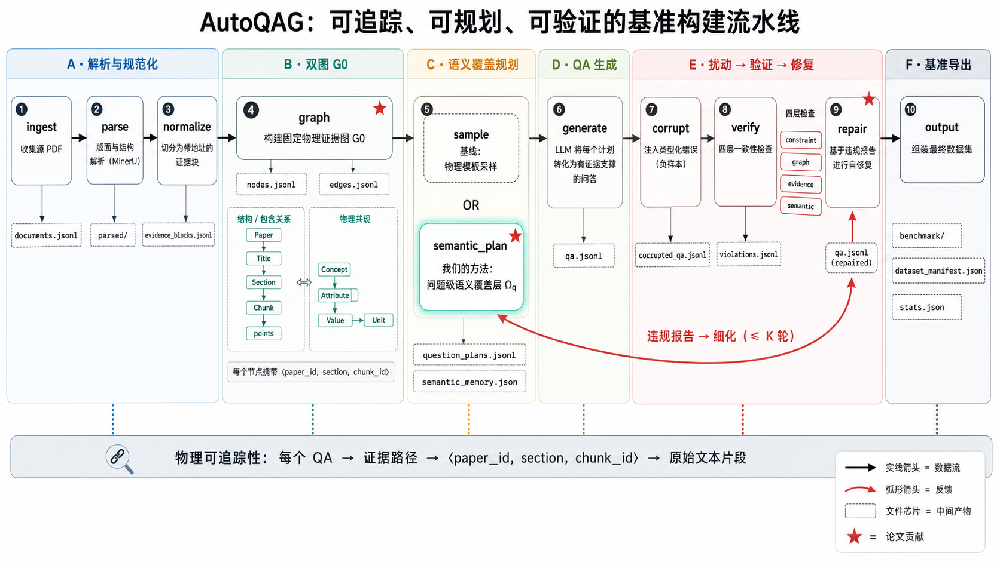
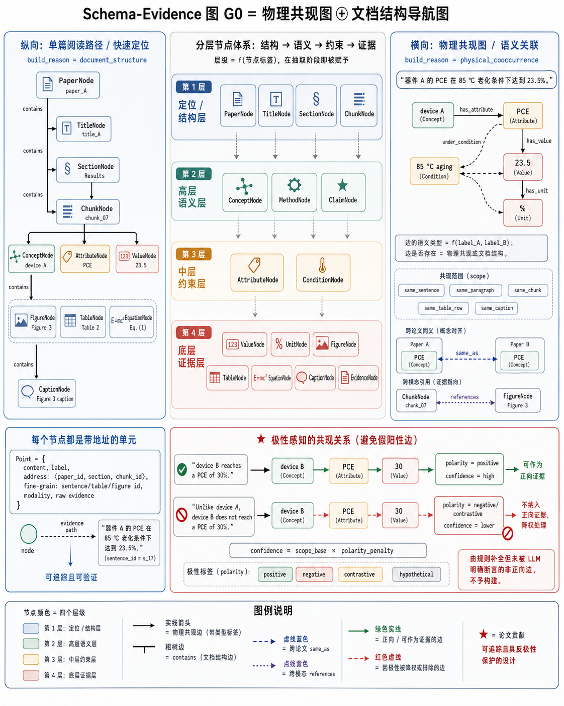
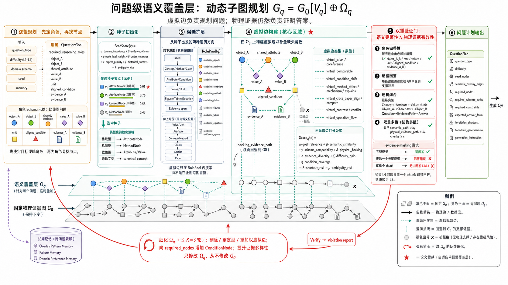

<div align="center">

# AutoQAGBenchmark

**图谱锚定式 Auto-QAG Benchmark 与高级训练语料构建框架**

📖 **简体中文** · [English](README.en.md)

把科研 PDF 自动转化为 *可追溯、可验证、可评测、可训练、可修复* 的科研智能数据资产。

</div>

---

## 一句话概述

现有 Auto-QAG 方法要么把知识压成一张平铺 KG（丢失证据来源、难以验证），要么直接在 chunk 上做检索拼题（伪多跳、条件丢失）。本项目提出 **"物理证据图 + 问题级语义覆盖层"双层架构**：底层是固定、可追溯的 Schema-Evidence 图 `G0`，上层为**每一道问题临时叠加**一组虚拟语义边 `Ωq`，从而让复杂问题"既有语义规划深度、又有物理证据支撑"，并支持违规驱动的自修复闭环。

---

## 三大创新点

| # | 创新点 | 解决什么问题 | 体现在 |
|---|---|---|---|
| **①** | **双层耦合 Schema-Evidence 图谱 + 反极性可追溯** | 平铺 KG 丢来源、且"纯共现"会把被否定的句子建成正向边 | 点天然分层；每点带 `⟨paper_id, section, chunk_id⟩` 地址；共现边带 `polarity/confidence`，被否定/对比/假设的边降权剔除 |
| **②** | **问题级语义覆盖层 Ωq（动态子图规划）** | 物理多跳 ≠ 语义多跳；固定图缺复杂问题的高层语义连接 | `Gq = G0[Vq] ⊕ Ωq`，按题型角色 schema 规划，八类虚拟边 + 问题级打分，虚拟边必须能回落到 G0 物理证据 |
| **③** | **双重验证 + 违规驱动自修复闭环** | 答案错了不知错在哪；伪多跳与条件遗漏无法定位 | 角色完整性 / 证据可回落 / 逻辑闭合 / 双重多跳（含证据遮蔽测试）四层检查；违规报告反向改写 `Ωq`（≤K 轮） |

> 消融实验已证明各模块逐步有效（`comp_bind` 0.11→0.68、`pseudo_multihop` 0.64→0、`utility` 0→5.14）。
> 详见 [autoqag/experiments/experiment_design.md](autoqag/experiments/experiment_design.md)。

---

## 整体流水线

将科研 PDF 经 10 个模块转化为基准数据集与高级训练语料：



```
PDF → MinerU 解析 → 证据归一化 → Schema-Evidence Graph(G0)
   → 子图采样 & 问题级语义规划(Question Plan) → QA + 高级训练语料
   → 负样本扰动 → 四层约束验证 → violation 驱动自修复 → 验证 QA + 语料
```

**六个阶段（对应上图 A–F）：**

- **A · 解析与归一化**：`ingest`（收集 PDF）→ `parse`（MinerU 版面解析）→ `normalize`（切分为带地址的证据块 `evidence_blocks.jsonl`）。
- **B · 双层图谱 G0**：`graph` 构建固定物理证据图，产出 `nodes.jsonl` + `edges.jsonl`。横向物理共现图（跨文献关联）与纵向文章结构图（单篇定位导航）耦合而成。
- **C · 语义覆盖层规划**：`sample`（基线：物理模板采样）或 **`semantic_plan`（本项目方法：问题级语义覆盖层 Ωq）**，产出 `question_plans.jsonl` + `semantic_memory.json`。
- **D · QA 生成**：`generate` 把每个 plan 经 LLM 落地为带证据的 QA（`qa.jsonl`）。
- **E · 腐蚀→验证→修复闭环**：`corrupt`（注入典型错误）→ `verify`（四层一致性检查，产 `violations.jsonl`）→ `repair`（违规驱动自修复）。
- **F · 基准导出**：`output` 组装为基准数据集与统计清单。

底部贯穿的**可追溯性缎带**：每条 QA → 证据路径 → `⟨paper_id, section, chunk_id⟩` → 原文 span，端到端不丢来源。

---

## 创新①：Schema-Evidence 双层图谱设计



图谱不是一张平铺 KG，而是**两张耦合子图**：

- **点的自然分层**（图中中央四层沉积带）：点在抽取阶段就天然带层级——
  - 定位/结构层 `PaperNode / TitleNode / SectionNode / ChunkNode`
  - 高层语义层 `ConceptNode / MethodNode / ClaimNode`
  - 中层约束层 `AttributeNode / ConditionNode`
  - 底层证据层 `ValueNode / UnitNode / FigureNode / TableNode / EquationNode / CaptionNode / EvidenceNode`
- **纵向 · 文章结构导航图**（左）：`PaperNode → Title → Section → Chunk → 点`，边为 `contains`（依据 = 文章自然结构），负责单篇文献的快速定位与阅读路径。
- **横向 · 物理共现图**（右）：在同句/同段/同 chunk/同表格行列/同图注内建边，**边的语义类型 = f(端点标签)**（如 `has_attribute / has_value / has_unit / under_condition`），**边是否建立 = 物理共现或文章结构**；并含跨文献 `same_as` 与跨模态 `references` 边。
- **可追溯**（左下角卡片）：每个点都是带地址的结构单元，`node → 证据路径 → 原文 span`。
- **反极性防护**（右下角，★ 创新）：纯共现的死穴是"`B does NOT reach 30%`"会被建成正向边。本项目在建边前做句级极性检测，`confidence = scope_base × polarity_penalty`：
  - ✅ 正向断言 → `polarity=positive`、高置信 → 可作正向证据；
  - ⛔ 否定/对比/假设 → 降权，且**规则补全（LLM 未断言）的非正向边直接不建**，被否定边不进入正向证据层。

---

## 创新②：问题级语义覆盖层（动态子图规划）



固定物理证据图 `G0` **保持不变**，针对每个问题 `q` 临时叠加一层虚拟语义边 `Ωq`，形成问题专属规划子图 `Gq = G0[Vq] ⊕ Ωq`。虚拟边只用于规划，**最终答案仍须回落到 G0 的物理证据**。六个阶段（对应上图 ①–⑥）：

1. **① 逻辑规划**（不是随机游走）：先按 `question_type / difficulty / domain / seed / memory` 确定题型的 `required_reasoning_roles`（如比较题需 `object_A/B · shared_attribute · value_A/B · unit · aligned_condition · evidence_A/B`），**先定角色、再找节点**。
2. **② 种子初始化**：按 `SeedScore(v) = α·domain_importance + β·evidence_richness + γ·node_level_weight + δ·under_coverage + ε·expert_priority + ζ·historical_success − λ·ambiguity_risk` 打分选种子，题型专属（比较题→AttributeNode、机制题→MethodNode 等）。
3. **③ 候选扩展**：**向下游走**取证据链（高层节点 → 概念/方法 → 属性/条件 → 数值/单位 → 图表 → 证据 span）+ **向上定位**确定语义归属（数值 → 属性 → 对象 → chunk → section → paper），收敛为 `RolePool(q)` 候选角色池。
4. **④ 虚拟边构建**（★ 核心创新）：在 RolePool 内建八类虚拟边（`virtual_comparable / condition_shift / method_effect / mechanism / cross_paper_align / contrast / operation_flow / alias` 等），按问题级 `Score_q(e)`（含 `physical_backing`、`difficulty_gain`、`−shortcut_risk`）打分；**每条被采纳的虚拟边都必须有回落到 G0 的 backing evidence path**，否则只作候选、不入子图。
5. **⑤ 双重验证门**：角色完整性 ∧ 证据可回落 ∧ 逻辑闭合 ∧ **双重多跳**（`semantic_path ≥ ks ∧ physical_evidence_path ≥ ke ∧ chunks ≥ c`，并做**证据遮蔽测试**：去掉关键证据答案应错、单 chunk 不能答 L3/L4，否则降级）。
6. **⑥ 问题计划输出**：产出含 `semantic_overlay_edges / required_nodes / required_evidence_paths / forbidden_shortcuts / forbidden_generalization` 的 `QuestionPlan`。

**反馈闭环**：`verify` 的违规报告反向改写 **`Ωq`（而非 G0）**，≤K=3 轮迭代；并沉淀三类长期记忆（Overlay Pattern / Failure / Domain Preference）用于初始化下一轮。

---

## 目录结构

```
autoqag/
├── registry.py        # [复用 data-juicer] stage 注册中心
├── config.py          # recipe.yaml 载入
├── pipeline.py        # stage 编排执行器 (CLI 入口)
├── schema.py          # 核心数据模型 (Address/EvidenceBlock/PointNode/Edge/QuestionPlan/QAItem/Violation)
├── common/            # LLM 客户端 / 限流 / 图存储 / IO / 日志
├── templates/         # 各阶段 LLM prompt
├── ops/               # 10 个流水线模块 (m1_ingest ... m10_output)
└── experiments/       # 消融与对比实验 (内部/外部指标)
recipes/mvp.yaml       # 完整闭环 recipe
docs/                  # 架构与各模块记录文档
image/                 # 论文主图 (主图/图构建/语义层/total)
data/raw/              # 放置输入 PDF
```

各模块输入/输出/复用见 [docs/pipeline_modules.md](docs/pipeline_modules.md)；产物字段规格见 [docs/data_formats.md](docs/data_formats.md)。

---

## 快速开始

```bash
# 1. 安装依赖
pip install -r requirements.txt
pip install -U "mineru[core]"          # 主解析器；纯 CPU 用 pipeline 后端即可

# 2. 配置 LLM (OpenAI 兼容)
export AUTOQAG_API_KEY=sk-xxx
export AUTOQAG_BASE_URL=https://api.deepseek.com/v1   # 可选，默认 OpenAI
export AUTOQAG_MODEL=deepseek-chat                    # 或在 recipe 里写 model

# 3. 放论文 → 跑完整流水线
cp your_papers/*.pdf data/raw/
python -m autoqag.pipeline --recipe recipes/mvp.yaml

# 4. 看结果
ls outputs/mvp/benchmark/          # benchmark.jsonl + human_review.jsonl
cat outputs/mvp/stats.json
```

### 局部调试

```bash
python -m autoqag.pipeline --recipe recipes/mvp.yaml --only graph     # 只跑某 stage
python -m autoqag.pipeline --recipe recipes/mvp.yaml --from sample    # 从某 stage 开始
python -m autoqag.pipeline --recipe recipes/mvp.yaml --skip corrupt   # 跳过某 stage
```

### 复现消融实验

```bash
# 内部指标 (无 LLM, 确定性)
PYTHONIOENCODING=utf-8 python -m autoqag.experiments.run_ablation --graph_dir outputs/five --per_type 12
# 外部对比 (无 LLM)
python -m autoqag.experiments.metrics_external --before outputs/cmp_before --after outputs/cmp_after
# 外部 LLM 评测 (judge / 难度判别力)
python -m autoqag.experiments.run_testtakers --mode judge --work_dir outputs/cmp_after
```

---

## 输出

| 输出 | 路径 |
|---|---|
| Benchmark 数据集 | `outputs/mvp/benchmark/benchmark.jsonl` |
| 高级训练语料 | `outputs/mvp/corpus/{instruction,graph_trace,rag_grounding,refusal,verifier,preference,repair}.jsonl` |
| 图谱数据 | `outputs/mvp/{nodes,edges}.jsonl` + `graph.graphml` |
| 统计 / 清单 | `outputs/mvp/stats.json` / `dataset_manifest.json` |

---

## 设计原则

- **高度模块化**：10 个 stage 各自独立，通过工作目录下命名 artifact (jsonl) 通信，可单独运行任一 stage 局部调试。
- **最大化复用**：复用/改编 data-juicer (registry)、GraphGen (LLM 客户端/限流/networkx 存储/抽取 prompt)、MinerU (PDF 解析)。
- **recipe 驱动 + LLM 通用**：全流程由 recipe 声明可复现；默认 OpenAI 兼容 API，可指向 DeepSeek / Qwen / 本地 vLLM。
